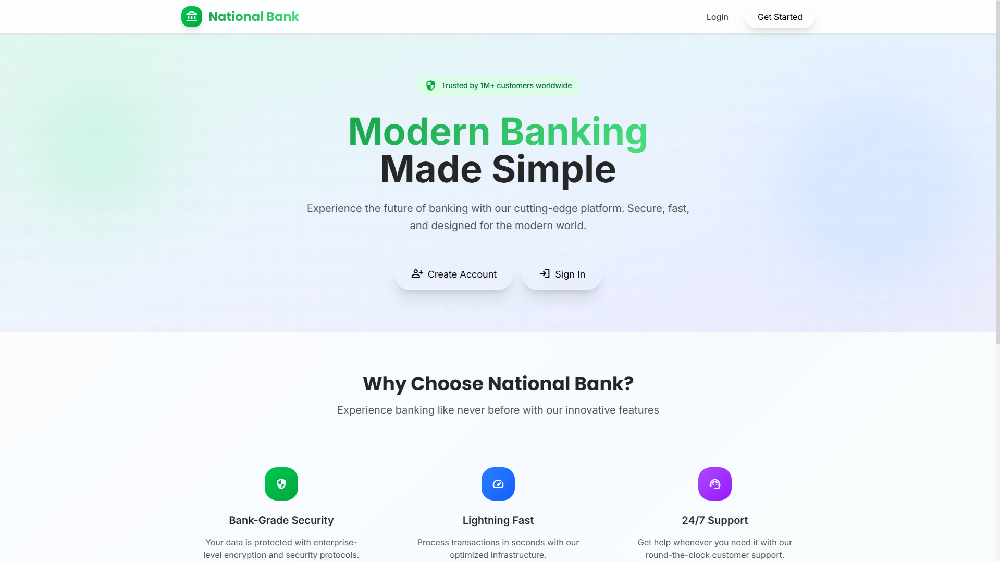
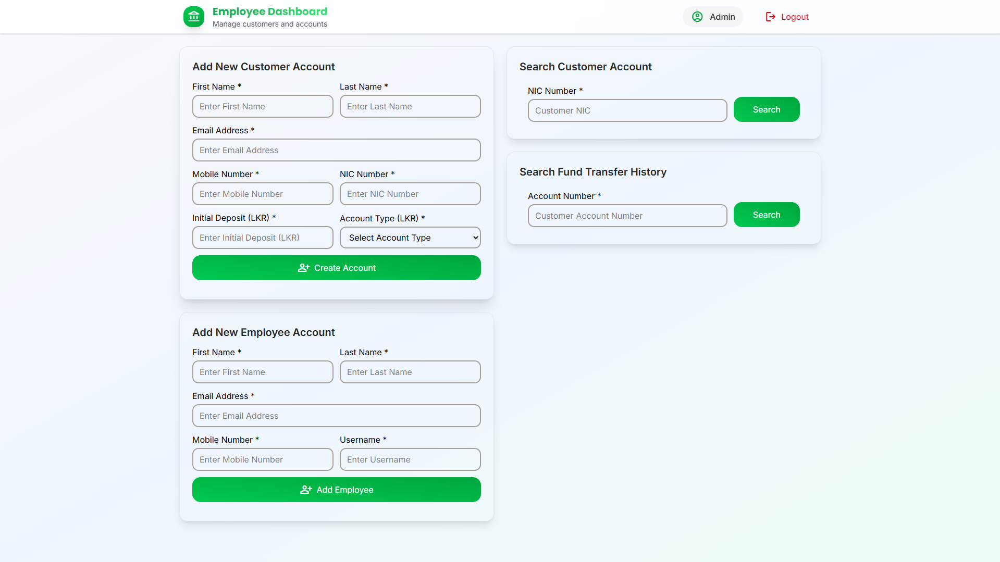
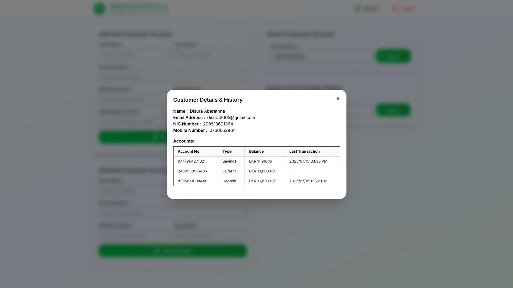
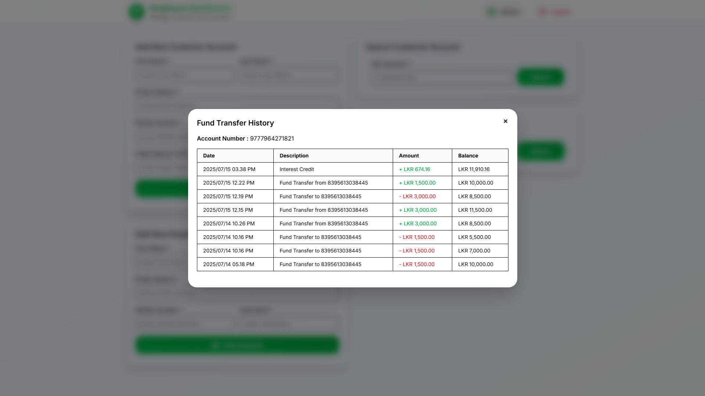
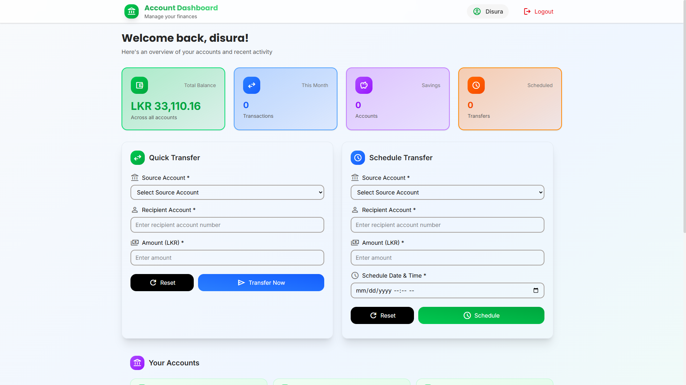
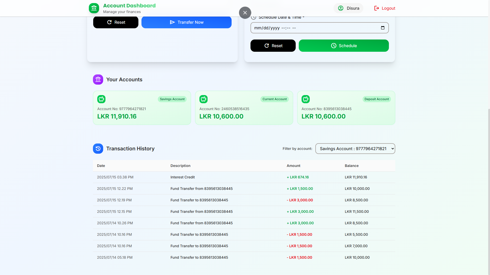

# National Bank

This is a modular banking system project that demonstrates enterprise Java concepts using **Enterprise JavaBeans (EJB)**, **Timer Services**, **JMS**, and other Java EE features.

## 🔍 Overview

The Bank Application provides a secure, role-based environment where customers and employees can manage accounts, perform fund transfers, and schedule automated transactions with notification and auditing support.

## ✅ Features

- Role-based authentication (admin, employee, customer)
- Fund transfer between accounts
- Scheduled fund transfers using EJB Timer Service
- Email notifications (e.g., OTP, registration, scheduled errors)
- Performance and audit logging with interceptors
- Transaction management and exception handling
- Modular Maven architecture

## 🧰 Technologies Used

- Java EE / Jakarta EE
- EJB (Stateless, Singleton)
- EJB Timer Service
- JPA (Java Persistence API)
- JavaMail API
- Maven
- Payara Server
- IntelliJ IDEA

## 📦 Project Structure

```
national-bank/
│
├── core-module/          # Core business logic: DTOs, models, enums, mail service
│   └── src/main/java/com/disuraaberathna/core/
│
├── ejb-module/           # EJB logic: session beans, interceptors, services
│
├── web-module/           # Web layer (servlets, JSPs, controllers)
│
├── ear-module/           # EAR project for deployment
│
├── pom.xml               # Parent Maven configuration
└── .idea/                # IntelliJ project configuration
```

## ⚙️ How to Build and Run

### Prerequisites

- Java JDK 11+
- Maven 3.6+
- Payara Server (or any Jakarta EE-compatible server)
- IntelliJ IDEA (optional)


### Steps

- Clone the repository:
   ```bash
   git clone https://github.com/DisuraAberathna/national-bank.git
   ```

- Build the project:
   ```bash
   mvn clean install
   ```

- Deploy the `ear-module/target/*.ear` file to Payara Server.

- Access the application via:
   ```
   http://localhost:8080/bank-web/
   ```

## ✉️ Mail Support

This project uses JavaMail to send:

- Fund Transfer OTPs
- Employee Registration Confirmations
- Verification Links
- Scheduled Transfer Failure Notices

> Ensure SMTP configuration is added to your `resources` or environment.

## 🛡️ Security & Logging

- Role-based method access control
- Performance and audit interceptors (`@Performance`, `@Audit`)
- Centralized exception handling

## 📷 Project Screenshots










---

© 2025 Disura Aberathna – For academic and demonstration purposes.
